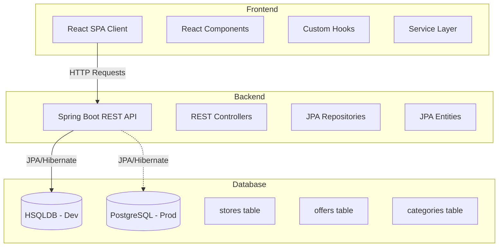

# Design Document: In-Store Offers Viewer

## Overview

The In-Store Offers Viewer is a web-based application that enables retail customers to browse and discover available offers while shopping in physical stores. The application will be built as a responsive single-page application (SPA) using React for the frontend, with a RESTful API backend using Node.js and Express. The system will support multiple store locations and provide real-time offer information with filtering, searching, and sorting capabilities.

### Technology Stack

- **Frontend**: React 18+ with TypeScript, React Router for navigation, TanStack Query for data fetching
- **Styling**: Tailwind CSS for responsive design
- **Backend**: Spring Boot 3.x with Java 17+
- **Database**: 
  - Development: HSQLDB (in-memory or file-based)
  - Production: PostgreSQL (configurable via Spring profiles)
  - ORM: Spring Data JPA with Hibernate
- **State Management**: React Context API and TanStack Query cache
- **Build Tools**: Maven for backend, Vite for frontend

## Architecture

### High-Level Architecture



### Application Layers

1. **Presentation Layer** (React Components)
   - Handles UI rendering and user interactions
   - Manages local component state
   - Delegates data fetching to custom hooks

2. **Data Access Layer** (API Services & Hooks)
   - Abstracts API communication
   - Manages caching and data synchronization
   - Provides reusable data fetching logic

3. **API Layer** (Spring Boot Controllers & Services)
   - Exposes RESTful endpoints via @RestController
   - Validates requests using Bean Validation
   - Service layer orchestrates business logic

4. **Data Layer** (Repositories & Models)
   - Repository interfaces for data access
   - Domain models define data structures
   - Handles data persistence and retrieval

## Components and Interfaces

### Frontend Components

#### 1. App Component
- Root component managing routing and global state
- Provides store location context to child components

#### 2. StoreSelector Component
- Allows users to select their current store location
- Supports manual selection and auto-detection (if available)
- Persists selection to localStorage

#### 3. OffersListView Component
- Main view displaying all available offers
- Integrates search, filter, and sort controls
- Renders offer cards in a responsive grid

#### 4. OfferCard Component
- Displays summary information for a single offer
- Shows title, discount, product image, and expiration date
- Clickable to navigate to offer details

#### 5. OfferDetailsView Component
- Full-page view of a single offer
- Displays complete terms, conditions, and requirements
- Provides navigation back to offers list

#### 6. SearchBar Component
- Text input for searching offers
- Debounced search to avoid excessive filtering
- Clear button to reset search

#### 7. FilterPanel Component
- Category filter checkboxes
- Additional filters (e.g., discount type, expiration range)
- Clear all filters button

#### 8. SortControl Component
- Dropdown for selecting sort criteria
- Options: discount amount, expiration date, category, newest

#### 9. CategoryView Component
- Alternative view grouping offers by category
- Collapsible category sections
- Category header shows offer count

### Backend Architecture (Spring Boot)

The Spring Boot backend follows a layered architecture:

1. **Controller Layer** (@RestController)
   - StoreController: Handles store-related endpoints
   - OfferController: Handles offer-related endpoints
   - CategoryController: Handles category endpoints

2. **Service Layer** (@Service)
   - StoreService: Business logic for stores
   - OfferService: Business logic for offers (filtering, sorting, validation)
   - CategoryService: Business logic for categories

3. **Repository Layer** (JpaRepository)
   - StoreRepository: Extends JpaRepository for store data access
   - OfferRepository: Extends JpaRepository with custom queries for filtering/searching
   - CategoryRepository: Extends JpaRepository for category data access

4. **Exception Handling** (@ControllerAdvice)
   - GlobalExceptionHandler: Centralized error handling

4. **Entity Layer** (@Entity)
   - JPA entities with proper relationships and constraints
   - Embedded types for complex value objects
   - Indexes for query optimization

5. **Configuration**
   - WebConfig: CORS configuration
   - Jackson configuration for JSON serialization
   - DataSource configuration with Spring profiles:
     - `dev` profile: HSQLDB (in-memory or file-based)
     - `prod` profile: PostgreSQL
   - JPA/Hibernate configuration with database-agnostic DDL

### Database Configuration

The application will support multiple database profiles:

#### Development Profile (application-dev.properties)
```properties
spring.datasource.url=jdbc:hsqldb:file:./data/offersdb
spring.datasource.driver-class-name=org.hsqldb.jdbc.JDBCDriver
spring.datasource.username=sa
spring.datasource.password=
spring.jpa.hibernate.ddl-auto=update
spring.jpa.show-sql=true
```

#### Production Profile (application-prod.properties)
```properties
spring.datasource.url=jdbc:postgresql://localhost:5432/offersdb
spring.datasource.driver-class-name=org.postgresql.Driver
spring.datasource.username=${DB_USERNAME}
spring.datasource.password=${DB_PASSWORD}
spring.jpa.hibernate.ddl-auto=validate
spring.jpa.show-sql=false
```

The JPA entities are designed to be database-agnostic, using standard JPA annotations and avoiding database-specific features. This allows seamless switching between HSQLDB and PostgreSQL.

### Database Schema

#### Tables

**stores**
- id (UUID, PK)
- name (VARCHAR, NOT NULL)
- street (VARCHAR)
- city (VARCHAR)
- state (VARCHAR)
- zip_code (VARCHAR)
- latitude (DOUBLE)
- longitude (DOUBLE)

**offers**
- id (UUID, PK)
- store_id (UUID, FK, NOT NULL, INDEXED)
- title (VARCHAR, NOT NULL)
- description (TEXT)
- category (VARCHAR, NOT NULL, INDEXED)
- discount_type (VARCHAR, NOT NULL)
- discount_value (DOUBLE, NOT NULL)
- original_price (DOUBLE)
- final_price (DOUBLE)
- image_url (VARCHAR)
- valid_from (TIMESTAMP, NOT NULL)
- valid_until (TIMESTAMP, NOT NULL, INDEXED)
- requires_loyalty_card (BOOLEAN)
- coupon_code (VARCHAR)
- minimum_purchase (DOUBLE)
- created_at (TIMESTAMP, NOT NULL)

**offer_terms** (Collection table)
- offer_id (UUID, FK)
- term (VARCHAR)

**offer_eligible_products** (Collection table)
- offer_id (UUID, FK)
- product (VARCHAR)

**offer_exclusions** (Collection table)
- offer_id (UUID, FK)
- exclusion (VARCHAR)

**categories**
- id (UUID, PK)
- name (VARCHAR, NOT NULL, UNIQUE)
- icon (VARCHAR)

### API Endpoints

#### Stores Endpoints

```
GET /api/stores
Response: List<Store>
Description: Get all available stores

GET /api/stores/{storeId}
Response: Store
Description: Get specific store details
```

#### Offers Endpoints

```
GET /api/stores/{storeId}/offers
Query params: 
  - category (optional): Filter by category
  - search (optional): Search in title/description
  - sortBy (optional): discount, expiration, category, newest
  - sortOrder (optional): asc, desc
Response: List<Offer>
Description: Get all active offers for a specific store

GET /api/offers/{offerId}
Response: Offer
Description: Get detailed information for a specific offer
```

#### Categories Endpoints

```
GET /api/categories
Response: List<Category>
Description: Get all available categories
```

### Data Models

#### Store Entity (JPA)

```java
@Entity
@Table(name = "stores")
public class Store {
  @Id
  @GeneratedValue(strategy = GenerationType.UUID)
  private String id;
  
  @Column(nullable = false)
  private String name;
  
  @Embedded
  private Address address;
  
  @Embedded
  @AttributeOverrides({
    @AttributeOverride(name = "latitude", column = @Column(name = "latitude")),
    @AttributeOverride(name = "longitude", column = @Column(name = "longitude"))
  })
  private Coordinates coordinates;
  
  @Embeddable
  public static class Address {
    private String street;
    private String city;
    private String state;
    private String zipCode;
  }
  
  @Embeddable
  public static class Coordinates {
    private Double latitude;
    private Double longitude;
  }
}
```

#### Offer Entity (JPA)

```java
@Entity
@Table(name = "offers", indexes = {
  @Index(name = "idx_store_id", columnList = "store_id"),
  @Index(name = "idx_category", columnList = "category"),
  @Index(name = "idx_valid_until", columnList = "valid_until")
})
public class Offer {
  @Id
  @GeneratedValue(strategy = GenerationType.UUID)
  private String id;
  
  @Column(name = "store_id", nullable = false)
  private String storeId;
  
  @Column(nullable = false)
  private String title;
  
  @Column(length = 1000)
  private String description;
  
  @Column(nullable = false)
  private String category;
  
  @Enumerated(EnumType.STRING)
  @Column(name = "discount_type", nullable = false)
  private DiscountType discountType;
  
  @Column(name = "discount_value", nullable = false)
  private Double discountValue;
  
  @Column(name = "original_price")
  private Double originalPrice;
  
  @Column(name = "final_price")
  private Double finalPrice;
  
  @Column(name = "image_url")
  private String imageUrl;
  
  @Column(name = "valid_from", nullable = false)
  private LocalDateTime validFrom;
  
  @Column(name = "valid_until", nullable = false)
  private LocalDateTime validUntil;
  
  @ElementCollection
  @CollectionTable(name = "offer_terms", joinColumns = @JoinColumn(name = "offer_id"))
  @Column(name = "term")
  private List<String> terms;
  
  @Column(name = "requires_loyalty_card")
  private Boolean requiresLoyaltyCard;
  
  @Column(name = "coupon_code")
  private String couponCode;
  
  @Column(name = "minimum_purchase")
  private Double minimumPurchase;
  
  @ElementCollection
  @CollectionTable(name = "offer_eligible_products", joinColumns = @JoinColumn(name = "offer_id"))
  @Column(name = "product")
  private List<String> eligibleProducts;
  
  @ElementCollection
  @CollectionTable(name = "offer_exclusions", joinColumns = @JoinColumn(name = "offer_id"))
  @Column(name = "exclusion")
  private List<String> exclusions;
  
  @Column(name = "created_at", nullable = false)
  private LocalDateTime createdAt;
  
  public enum DiscountType {
    PERCENTAGE, FIXED, BOGO, BUNDLE
  }
}
```

#### Category Entity (JPA)

```java
@Entity
@Table(name = "categories")
public class Category {
  @Id
  @GeneratedValue(strategy = GenerationType.UUID)
  private String id;
  
  @Column(nullable = false, unique = true)
  private String name;
  
  @Column
  private String icon;
}
```

#### Frontend TypeScript Interfaces

The frontend will use TypeScript interfaces matching the backend models:

```typescript
interface Store {
  id: string;
  name: string;
  address: {
    street: string;
    city: string;
    state: string;
    zipCode: string;
  };
  coordinates?: {
    latitude: number;
    longitude: number;
  };
}

interface Offer {
  id: string;
  storeId: string;
  title: string;
  description: string;
  category: string;
  discountType: 'PERCENTAGE' | 'FIXED' | 'BOGO' | 'BUNDLE';
  discountValue: number;
  originalPrice?: number;
  finalPrice?: number;
  imageUrl?: string;
  validFrom: string;
  validUntil: string;
  terms: string[];
  requiresLoyaltyCard: boolean;
  couponCode?: string;
  minimumPurchase?: number;
  eligibleProducts: string[];
  exclusions?: string[];
  createdAt: string;
}

interface Category {
  id: string;
  name: string;
  icon?: string;
}
```

## Data Flow

### Viewing Offers Flow

1. User selects store location (or app detects it)
2. Frontend requests offers from `/api/stores/:storeId/offers`
3. Backend retrieves offers for the store, filters out expired ones
4. Frontend receives offers and caches them with TanStack Query
5. User applies filters/search/sort
6. Frontend filters cached data client-side for instant response
7. Filtered offers are displayed in the UI

### Viewing Offer Details Flow

1. User clicks on an offer card
2. Frontend navigates to `/offers/:offerId` route
3. If offer details are in cache, display immediately
4. Otherwise, fetch from `/api/offers/:offerId`
5. Display complete offer details
6. User can navigate back to offers list

## Error Handling

### Frontend Error Handling

1. **Network Errors**
   - Display user-friendly error message
   - Provide retry button
   - Show cached data if available

2. **No Offers Found**
   - Display helpful message suggesting to adjust filters
   - Show all categories to help user explore

3. **Invalid Store Selection**
   - Redirect to store selector
   - Show error message explaining the issue

4. **Failed Offer Details Load**
   - Display error message
   - Provide button to return to offers list

### Backend Error Handling

Spring Boot will use @ControllerAdvice for centralized exception handling:

1. **Invalid Store ID**
   - Throw ResourceNotFoundException
   - Return 404 with error message
   - Log the invalid request

2. **Invalid Offer ID**
   - Throw ResourceNotFoundException
   - Return 404 with error message

3. **Invalid Query Parameters**
   - Use @Valid annotation for validation
   - Return 400 with validation errors
   - Provide clear error messages via MethodArgumentNotValidException handler

4. **Server Errors**
   - Return 500 with generic error message
   - Log detailed error for debugging using SLF4J
   - Never expose internal details to client

5. **Error Response Format**
   ```java
   public class ErrorResponse {
     private LocalDateTime timestamp;
     private int status;
     private String error;
     private String message;
     private String path;
   }
   ```

## Testing Strategy

### Unit Testing

1. **Component Tests**
   - Test each component in isolation
   - Mock API calls and hooks
   - Verify rendering with different props
   - Test user interactions (clicks, input changes)

2. **Hook Tests**
   - Test custom hooks with React Testing Library
   - Verify data fetching and caching behavior
   - Test error handling

3. **Utility Function Tests**
   - Test filtering logic
   - Test sorting logic
   - Test date validation and formatting

4. **API Endpoint Tests**
   - Use @WebMvcTest for controller tests
   - Mock service layer with @MockBean
   - Test each endpoint with various inputs using MockMvc
   - Verify response formats
   - Test error conditions

### Integration Testing

1. **API Integration Tests**
   - Use @SpringBootTest for full integration tests
   - Test complete request/response cycles
   - Verify data persistence
   - Test query parameter handling
   - Use TestRestTemplate or WebTestClient

2. **Component Integration Tests**
   - Test component interactions
   - Verify data flow between parent and child components
   - Test routing and navigation

### End-to-End Testing

1. **User Flow Tests**
   - Test complete user journeys (select store → browse offers → view details)
   - Test search and filter workflows
   - Test responsive behavior on different screen sizes

## Performance Considerations

1. **Data Caching**
   - Use TanStack Query for automatic caching
   - Cache offers data for 5 minutes
   - Cache store list indefinitely (rarely changes)

2. **Lazy Loading**
   - Implement virtual scrolling for large offer lists
   - Lazy load offer images

3. **Debouncing**
   - Debounce search input (300ms)
   - Debounce filter changes if needed

4. **Code Splitting**
   - Split routes for lazy loading
   - Load offer details view only when needed

## Security Considerations

1. **Input Validation**
   - Validate all API inputs
   - Sanitize search queries
   - Validate store and offer IDs

2. **Rate Limiting**
   - Implement rate limiting using Spring interceptors or filters
   - Prevent abuse of search/filter endpoints

3. **CORS Configuration**
   - Configure CORS using WebMvcConfigurer
   - Restrict origins in production environment
   - Allow appropriate HTTP methods and headers

4. **Spring Security** (Optional for MVP)
   - Can be added later for authentication/authorization
   - Currently focusing on public offer viewing

## Accessibility

1. **Keyboard Navigation**
   - All interactive elements accessible via keyboard
   - Logical tab order
   - Visible focus indicators

2. **Screen Reader Support**
   - Semantic HTML elements
   - ARIA labels where needed
   - Announce dynamic content changes

3. **Visual Accessibility**
   - Sufficient color contrast (WCAG AA)
   - Scalable text
   - Clear visual hierarchy

## Future Enhancements

1. **User Accounts**
   - Save favorite offers
   - Offer notifications
   - Shopping lists

2. **Advanced Features**
   - Barcode scanning to check if product has offers
   - Push notifications for new offers
   - Personalized offer recommendations

3. **Analytics**
   - Track popular offers
   - Monitor search patterns
   - A/B testing for UI improvements
